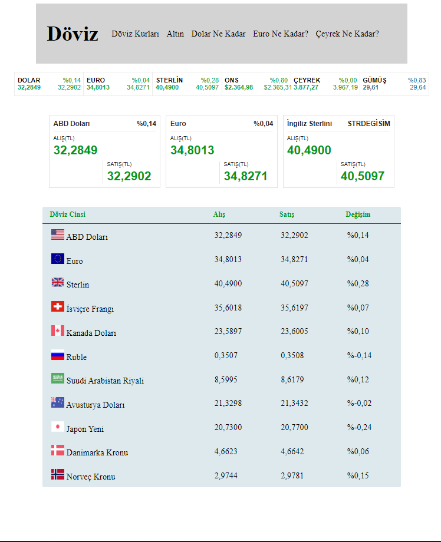

# PHP DÖVİZ
# TRUNCGİL AKADEMİ DÖVİZ APİLERİ
- Güncel Döviz Kuru verilerini internette bulmamız çok basittir. Peki bu bilgileri doğru ve etkili olarak nasıl kullanabiliriz sorusunu sizlere açıklamak ve uygulamalı olarak göstermek adına oluşturduğum Güncel Döviz Bilgilerine ulaşabileceğiniz web projesidir.
- Ticari amaç için kullanılmaz.<br> <br> <br>
 <br> <br>


# echo Komutu Kullanarak veri çağırma işlemi:
Yukarıda verilen php kodları ile JSON kaynağından okuduğumuz verileri <b>echo</b> komutu ile çağırabiliriz.Ben çekeceğim verileri define olarak çektim siz değişkenlerede atayabilirsiniz.
- Dolar Alış Fiyatı: <b>DOLARALİS</b> sabiti için <b>echo</b> kullanımı:
```php
<?php echo DOLARALİS; ?>
```
- Dolar Satış Fiyatı: <b>DOLARSATİS</b> sabiti için <b>echo</b> kullanımı:
```php
<?php echo DOLARSATİS; ?>
```
- Euro Alış Fiyatı: <b>EURALİS</b> sabiti için <b>echo</b> kullanımı:
```php
<?php echo EURALİS; ?>
```
- Euro Satış Fiyatı: <b>EURSATİS</b> sabiti için <b>echo</b> kullanımı:
```php
<?php echo EURSATİS; ?>
```
- Sterlin Alış Fiyatı: <b>STRALİS</b> sabiti için <b>echo</b> kullanımı:
```php
<?php echo "$STRALİS"; ?>
```
-Sterlin Satış Fiyatı: <b>$STRSATİS</b> sabiti için <b>echo</b> kullanımı:
```php
<?php echo "$STRSATİS"; ?>
```
- Diğer kurlar içinde aynı şlemi uygulayabilirsiniz.
- Umarım kolay ve analışılır bir anlatım olmuştur. İhtiyacınızı karşılamasını dilerim.
